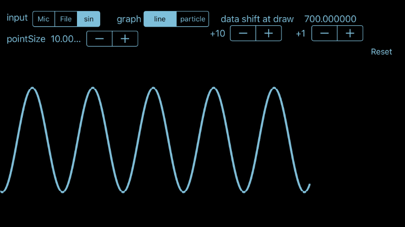

# TuningEye

This project is a research project when I created a tuner app for violin for iOS.  
["TuningToneForViolin"](https://itunes.apple.com/app/tuningtoneforviolin/id719362890?mt=8).

TuningEye is a iOS app written in Objective-c. It's draw input data from microphones, stored PCM files, and sin waves generated in code by OpenGL ES.

How to Run
---
1.Clone.

2.Open TuningEye.xcodeproj with Xcode.

3.Chenge TARGET->GENERAL->Signing->Team to yours.

4.Run. 

Usage
---
* input select

  Mic: Microphone input.

  File: Load data from file.

  Sin: Ganarate sin wave and show.

* graph

   line: Draw with the OpenGL draw line.

   particle: Draw with the OpenGL draw particle.

* data offset at draw

   Data offset to get data from input buffer for draw. The movement of the graph in relation to the AudioUnit sampling rate and the GLKView update rate.

* Reset
   Reset "data offset at draw" to default.

* pointSize

   Line width.
